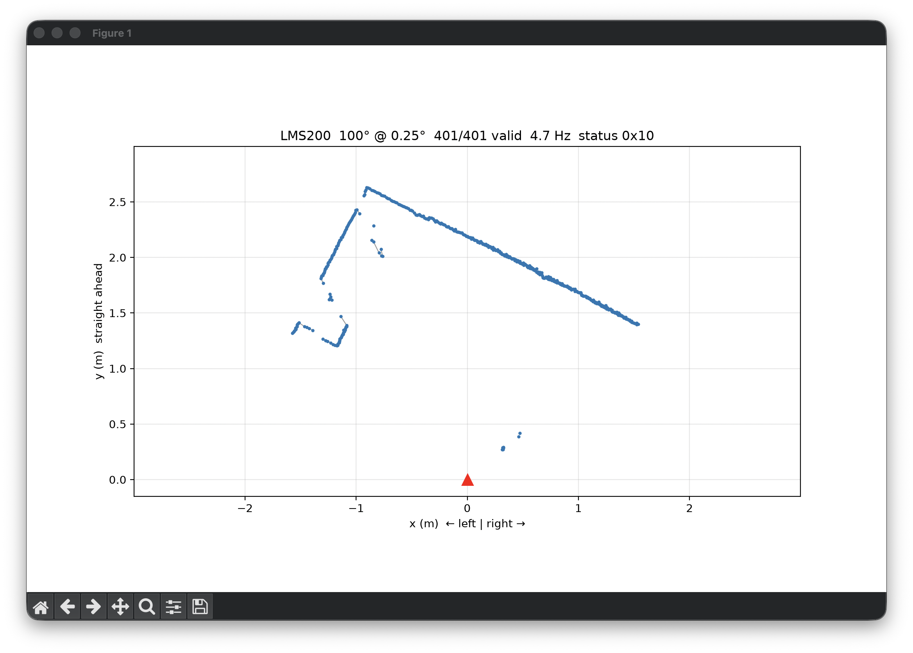

# SICK LMS200 driver for Python

[](https://github.com/manorajesh/sick-lidar/actions/workflows/tests.yml)
[](LICENSE)
[](pyproject.toml)
[](#scanner-settings-to-know-about)
[](#wiring)

<p align="center">
  
  <br>
  <sub>Live view (<code>lidar.py --fov 100 --resolution 0.25 view</code>): room walls as seen from the scanner (red triangle).</sub>
</p>

A small Python driver and command-line tool for the **SICK LMS200** 2D laser
scanner (and likely other LMS2xx models) over RS-232. It needs no SICK
software; it was written from SICK's published protocol manuals.

- Connects at whatever baud rate the scanner is using (9600, 19200 or 38400)
- Single scans, continuous streaming, CSV recording, and a live top-down map
- Reads the scanner's configuration and can switch between mm and cm units
- Offline tests built from the manual's example packets

Tested on macOS (Apple Silicon) with an LMS200-30106 (firmware V02.10) and a
Keyspan USA-19HS USB-serial adapter. Any USB-to-RS-232 adapter should work
(pass `--port`), but only the Keyspan has been tested.

## Install

```sh
git clone <this repo> && cd sick-lidar
python3 -m venv .venv
.venv/bin/pip install -e ".[view]"     # drop [view] if you don't need the live plot
```

## Usage

```sh
.venv/bin/python lidar.py info                  # identify scanner, read stored config
.venv/bin/python lidar.py scan                  # one scan as an angle/range table
.venv/bin/python lidar.py record out.csv -n 100 # stream scans to CSV (-n 0 = until Ctrl-C)
.venv/bin/python lidar.py view                  # live top-down map, auto-fits the room (--rmax to fix)
.venv/bin/python lidar.py --fov 100 --resolution 0.25 view   # 0.25° steps over the middle 100°
.venv/bin/python lidar.py units mm|cm           # permanently set distance units (writes EEPROM)
```

After `pip install`, the same commands are also available as `lms200 <command>`.

- The port is auto-detected (Keyspan by USB vendor ID, or the only USB serial
  port present). Use `--port /dev/…` to choose one.
- `--fov`/`--resolution` are not saved on the scanner; it returns to 180°/0.5° at power-up.
- `units` is the only command that writes the scanner's EEPROM, which has limited
  write cycles, so don't call it in a loop. Everything else is read-only or resets at power-up.

CSV columns: `scan, timestamp, angle_deg, range_m, raw`. Angles run 0°→180°
right to left (viewed from above); 90° is straight ahead. Empty `range_m` means
no valid return (out of range, dazzle, or another error code).

From your own code:

```python
from lms200 import LMS200

with LMS200() as lms:          # or LMS200("/dev/ttyUSB0")
    lms.connect()              # finds the scanner at 9600/19200/38400, switches to 38400
    lms.get_config()           # reads distance units and bit layout
    lms.set_variant(180, 0.5)
    lms.start_stream()
    for scan in lms.stream():
        print(scan.ranges_m[180], scan.points_xy()[:3])  # index 180 = 90° = straight ahead
        break
    lms.stop_stream()
```

## Tests

```sh
.venv/bin/python -m unittest discover tests
```

They run without a scanner. They check the checksum against the example packets
printed in SICK's manuals and decode synthetic scans (mm/cm, error codes, 100° field,
corrupted frames).

## Repository layout

| Path | Purpose |
|---|---|
| `lms200.py` | Driver: framing, checksum, commands, scan decoding |
| `lidar.py` | Command-line tool (`info`, `scan`, `units`, `record`, `view`) |
| `tests/` | Offline protocol tests (run in CI by `.github/workflows/tests.yml`) |
| `docs/` | Images for this README |
| `local/` | Git-ignored. For your copies of the manuals and notes about your own scanner |

### Reference manuals (not included)

The driver is based on these SICK documents. They are © SICK AG, all rights
reserved, so they aren't redistributed here. Search for the title or document
number to find them, and keep your copies in `local/`:

| Referred to below as | Document |
|---|---|
| **Telegram listing** | *Telegram listing LMS2xx Laser Measurement Systems*, SICK 8007954 (2006-08) |
| **Quick manual** | *Quick Manual for LMS communication setup*, SICK, version 1.0 (June 2001) |
| **Supplement** | *Technical Information LMS200/211/221/291: Supplement to Technical Description*, SICK 8012678 (2008-09) |

## Scanner settings to know about

Secondhand scanners often aren't at factory settings. Run `lidar.py info` to see yours.

- **Power-on baud rate.** The factory default is 9600, but a scanner can be set
  to keep another speed across power-ups (command `66`, §7.37, p.87).
  `connect()` tries 9600, 38400 and 19200.
- **Distance units.** In mm mode readings come in 1 mm steps up to 8.191 m, and
  farther surfaces read as no return. In cm mode they come in 1 cm steps up to
  ~81 m. Switch with `lidar.py units mm|cm`, which prints the stored
  configuration before and after the change.
- **Measuring mode.** This decides what the top bits of each reading mean
  (field flags or reflectivity levels; §7.46.1, p.98). `get_config()` reads it,
  and the decoder uses it to find the distance bits.
- **Throughput.** At 180° / 0.5° a scan is 361 readings, and 38400 baud carries
  about 4.7 scans/s.

## Wiring

The link needs exactly **one** swap of pins 2 and 3 between the PC and the LMS.
SICK's data cable already swaps them (quick manual B.3, p.7), so adding a
null-modem adapter or cable cancels the swap. The scanner then looks dead: no
replies and no power-on message.

A working chain:

```
LMS data port → SICK data cable → straight-through DB9 M/F extension → Keyspan USA-19HS → USB
```

Also make sure pins 7 and 8 are **not** bridged in the LMS connector, because
that selects RS-422 (supplement §1.1, p.3).

To test the USB adapter on its own, bridge pins 2 and 3 on its DB9 connector
(loopback). Anything you send should come straight back.

## How this was figured out

No SICK software was used. Everything was built from the three SICK manuals
listed under [Reference manuals](#reference-manuals-not-included) and then tested
against a real scanner. Page numbers are the ones printed on the pages; a bare §
refers to the telegram listing.

### 1. Learning the protocol from the manuals

The scanner speaks a binary protocol of short packets called *telegrams*. Each
part of the driver comes from a specific section of the manuals:

| What | Source | Code |
|---|---|---|
| Serial format: 8 data bits, no parity, 1 stop bit; 9600 / 19200 / 38400 baud | Telegram listing §4.1, p.21 | `LMS200.__init__`, `connect()` |
| Packet layout: `02` · address · length (2 bytes, low byte first) · command · data · checksum. Replies set the high bit on the address and command (`80`, `A0`, `B0`…) and add a status byte before the checksum | §4.2, pp.21–23 | `build_telegram()`, `_parse_one()` |
| Checksum: CRC-16 with polynomial `0x8005` (C code given in the manual) | §9, pp.107–108 | `crc16()` |
| Handshake: the scanner sends `06` (ACK) and then its reply, or `15` (NAK) on a bad checksum; mode changes take up to 3 s | §4.3, p.24 | `request()`, `_wait_ack()` |
| Commands used: `20` operating mode / baud / password, `30` one scan, `31` status, `3A` type, `3B` angle and resolution, `74` read config, `77` write config | §7.4, 7.5, 7.6, 7.15, 7.16, 7.43, 7.46 | one method each in `LMS200` |
| Scan data: a count word (bits 14–15 = unit) followed by one 2-byte word per angle. The low 13 bits are the distance; the top 3 bits are flags | §3.4.1, p.19; §7.5.2, pp.47–51; quick manual D.1, p.14 | `_decode_scan()` |
| Values of `0x1FF7` and above are error codes (no return, dazzle…), not distances | §10.8, p.124 | `_decode_scan()` → `NaN` |
| A 100° scan covers 40°–140° of the 180° frame | §7.5.2, p.48 | `_decode_scan()` |
| Example packets with known-good checksums, used as test cases | Quick manual C.2–C.9, pp.9–14; telegram listing examples throughout §7 | checked before first use |

Before anything was sent to the scanner, `crc16()` was checked against 7 example
packets from the manuals (e.g. status request `02 00 01 00 31 15 12`, start
streaming `02 00 02 00 20 24 34 08`). It matched all of them. A synthetic scan
reply was also decoded to check the parser: 732 bytes with length `D6 02`,
matching the manual's example (§7.5.2, p.51).

### 2. Debugging the connection

The scanner did not answer at first. Each test ruled out one possible cause:

| # | Test | Result | Conclusion |
|---|---|---|---|
| 1 | Checked macOS devices (`ls /dev/cu.*`, `ioreg`) | Keyspan listed, driver `com.keyspan.KeyspanUSBdriver1` loaded | Adapter and driver installed |
| 2 | Sent the status request at 9600, 19200 and 38400 baud, with DTR/RTS on and off | No bytes back | Not a simple speed or handshake-line problem |
| 3 | Listened while the scanner was power-cycled. It always sends a startup telegram (`90`) when it powers up (§6.1, p.29; quick manual C.2, p.9) | 0 bytes | Nothing from the scanner was reaching the Mac |
| 4 | Paperclip across Keyspan pins 2 and 3 (loopback) | Sent data came straight back | Keyspan, driver and code all fine, so the fault is in the cabling |
| 5 | Traced the cable chain against the quick manual (B.3, p.7: *"PINs 2 and 3 are crossed in the cable"*) | The SICK cable crosses pins 2/3, and an inline null-modem adapter in the chain crossed them again | Two crossings cancel; transmit was wired to transmit |
| 6 | Removed the adapter while a probe sent a status request every 0.5 s | Valid 161-byte status reply at **38400 baud** | Working |

Two findings were built into the code:
- **The scanner answered at 38400, not the factory 9600**, because it had been set
  to keep that speed across power-ups (command `66`, §7.37, p.87). `connect()`
  tries all three speeds.
- **The Keyspan's device name changes** when it's re-plugged or the Mac sleeps.
  `find_port()` looks the adapter up by its USB vendor ID (`0x06CD`) instead.

The data-port pinout was also checked against the corrected table in the
supplement (§1.1, p.3). Pins 7 and 8 must *not* be bridged in the LMS
connector: a bridge switches the port to RS-422, which the Keyspan cannot talk to.

### 3. Verifying the data

- The model, firmware version and serial number reported by the scanner (`3A`
  type and `31` status replies) matched the labels on its housing. The last
  digit of the type reply (`LMS200;30106x;V02.10`) read `3` in cm mode and `1`
  after switching to mm; the manual (§7.15.2, p.65) doesn't say what it encodes.
- In a recording of 30 streamed scans, all 30 were complete, with all 361
  readings valid in each. The reading straight ahead was 2.004 m ± 0.5 cm across scans.

### 4. Switching cm → mm

The unit is one byte (block E) in the 34-byte stored configuration (§7.46.1,
p.98). Every write uses up one of the EEPROM's limited write cycles (§6.3, p.30),
so `set_units()` works like this:

1. Reads the current configuration (`74`, §7.43, p.90). `lidar.py units` prints
   it first, so you can keep a copy.
2. Changes only that one byte; the other 33 bytes are written back unchanged.
3. Enters installation mode with the default password `SICK_LMS` (`20 00`, §7.4.1, p.40).
4. Writes the configuration (`77`) and requires status `01` plus an exact echo of
   what was sent (§6.3.1, p.32).
5. Returns to normal mode (`20 25`, §6.3.2, p.33) and reads the configuration
   again to confirm the change.

Result: 1 mm steps instead of 10 mm. Scan-to-scan jitter per point went from about
5 mm to about 3 mm (measured in a slightly changed scene, so approximate).

### 5. Limits that remain

- **~4.7 scans/s**, although the scanner measures 75 times a second: 38400 baud
  can't carry more. Full rate needs 500 kbaud over RS-422, which means a
  different USB adapter and different wiring (quick manual D.2, pp.15–17).
- **0.25° steps only over 100°** (`3B`, §7.16, p.66). 180° is limited to 0.5°.
- **8.19 m maximum range** in mm mode (§3.4.1, p.20). Use `lidar.py units cm` for up to ~81 m.

## License

[MIT](LICENSE). SICK and LMS are trademarks of SICK AG. This project is not
affiliated with or endorsed by SICK.
